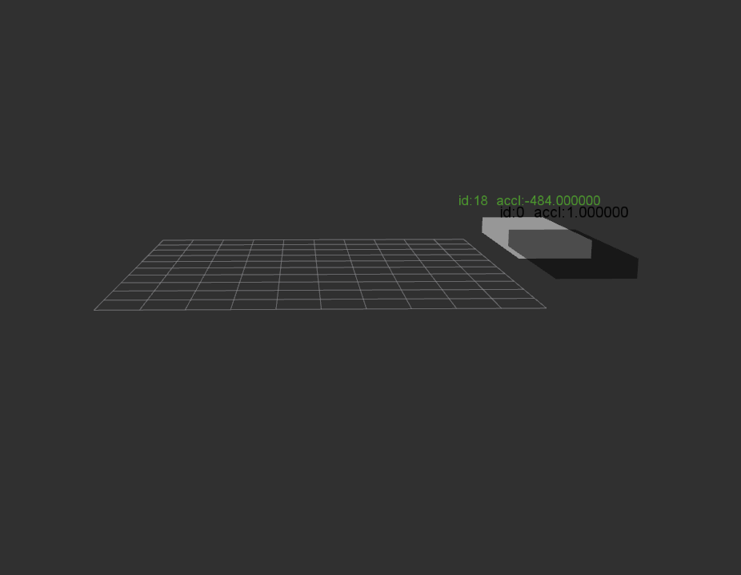

# ESR CANalyst-ii ROS package
It contains the [CANalyst-ii](https://detail.tmall.com/item.htm?spm=a230r.1.14.6.1d07e0efi7clwK&id=542301692415&cm_id=140105335569ed55e27b&abbucket=3) driver and wrapped interface for ROS, A.W.A the ESR Radar with visualization(marker) support in Rviz. The usage and comments are updating, will soon be finished.

### Screenshot
Detected objects will be display as `Marker` in Rviz, currently the size of object is fixed now. On top of the cube marker, there is the `object ID=[0,63]`, and `acceleration speed` parsed from the ESR radar.	


### Usage
```shell
roslaunch esr.launch
```
	
Note that there will be permission issue on the USB-Canalyst II device. If so, you have to check the USB device ID, modify the udev-usb list, and change the user group of that USB device.